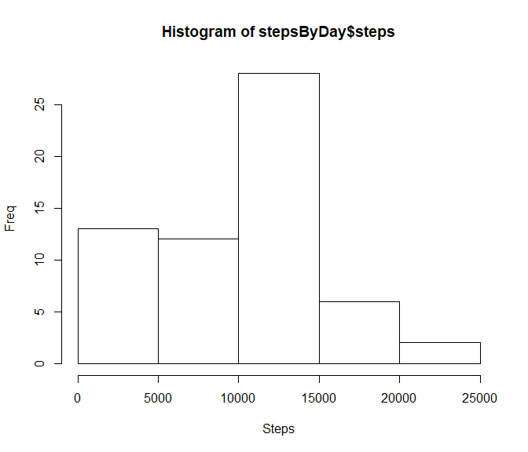
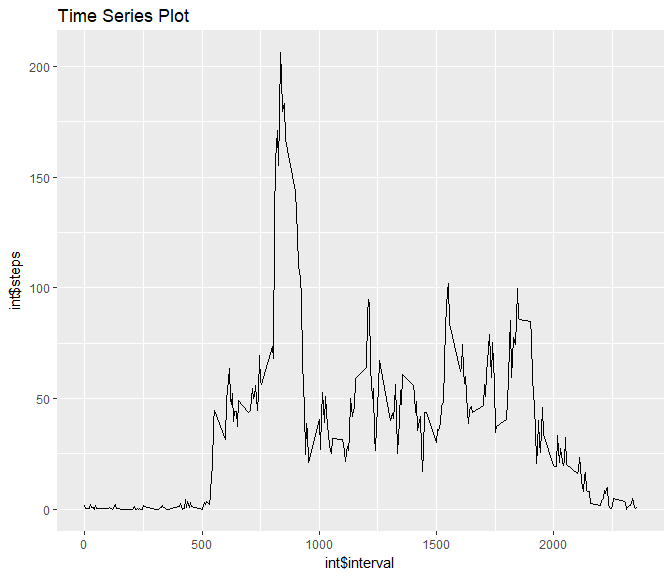
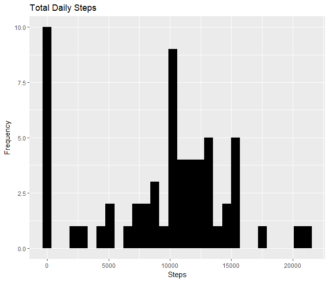
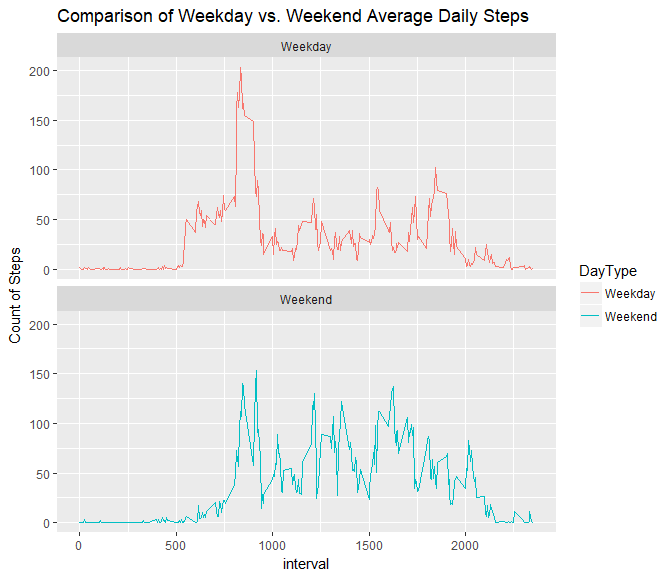

## Loading and preprocessing the data

```r
raw <- data.table::fread("C:/Users/msnyder/OneDrive - Rainforest Alliance/Mgmt/Training/Coursera/DataScience/Course5_ReproducibleResearch/Week2/Project/activity.csv")
```

## What is mean total number of steps taken per day?

```r
stepsByDay <- raw[, c(lapply(.SD, sum, na.rm = TRUE)), .SDcols = c("steps"), by = .(date)]
```

```r
hist(stepsByDay$steps, xlab = "Steps", ylab = "Freq")
```

<!-- -->

```r
stepsByDay[, .(Mean_Steps = mean(steps, na.rm = TRUE), Median_Steps = median(steps, na.rm = TRUE))]
```

```
##    Mean_Steps Median_Steps
## 1:    9354.23        10395
```
## What is the average daily activity pattern?

```r
int <- raw[, c(lapply(.SD, mean, na.rm = TRUE)), .SDcols = c("steps"), by = .(interval)]

library(ggplot2)
```

```r
ggplot(int, aes(x = interval , y = steps)) + geom_line(color="black") + labs(title = "Time Series Plot", x = "int$interval", y = "int$steps")
```

<!-- -->

```r
int[steps == max(steps), .(max_interval = interval)]
```

```
##    max_interval
## 1:          835
```
## Imputing missing values

```r
raw[is.na(steps), .N ]
```

```
## [1] 2304
```

```r
raw[is.na(steps), "steps"] <- raw[, c(lapply(.SD, median, na.rm = TRUE)), .SDcols = c("steps")]

data.table::fwrite(x = raw, file = "activityFilled.csv")

steps <- raw[, c(lapply(.SD, sum)), .SDcols = c("steps"), by = .(date)] 

steps[, .(Mean_Steps = mean(steps), Median_Steps = median(steps))]
```

```
##    Mean_Steps Median_Steps
## 1:    9354.23        10395
```

```r
ggplot(steps, aes(x = steps)) + geom_histogram(fill = "black") + labs(title = "Total Daily Steps", x = "Steps", y = "Frequency")
```

```
## `stat_bin()` using `bins = 30`. Pick better value with `binwidth`.
```

<!-- -->
## Are there differences in activity patterns between weekdays and weekends?

```r
raw <- data.table::fread("C:/Users/msnyder/OneDrive - Rainforest Alliance/Mgmt/Training/Coursera/DataScience/Course5_ReproducibleResearch/Week2/Project/activity.csv")
raw[, date := as.POSIXct(date, format = "%Y-%m-%d")]
raw[, `DayOfWeek`:= weekdays(x = date)]
raw[grepl(pattern = "Monday|Tuesday|Wednesday|Thursday|Friday", x = `DayOfWeek`), "DayType"] <- "Weekday"
raw[grepl(pattern = "Saturday|Sunday", x = `DayOfWeek`), "DayType"] <- "Weekend"
raw[, `DayType` := as.factor(`DayType`)]

raw[is.na(steps), "steps"] <- raw[, c(lapply(.SD, median, na.rm = TRUE)), .SDcols = c("steps")]
int <- raw[, c(lapply(.SD, mean, na.rm = TRUE)), .SDcols = c("steps"), by = .(interval, `DayType`)]
```

```r
ggplot(int, aes(x = interval, y = steps, color=`DayType`)) + geom_line() + labs(title = "Comparison of Weekday vs. Weekend Average Daily Steps",x="interval", y = "Count of Steps") + facet_wrap(~`DayType`, ncol = 1, nrow=2)
```

<!-- -->
